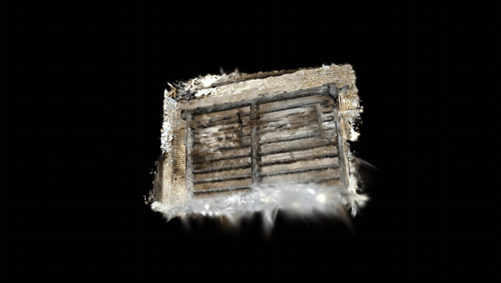
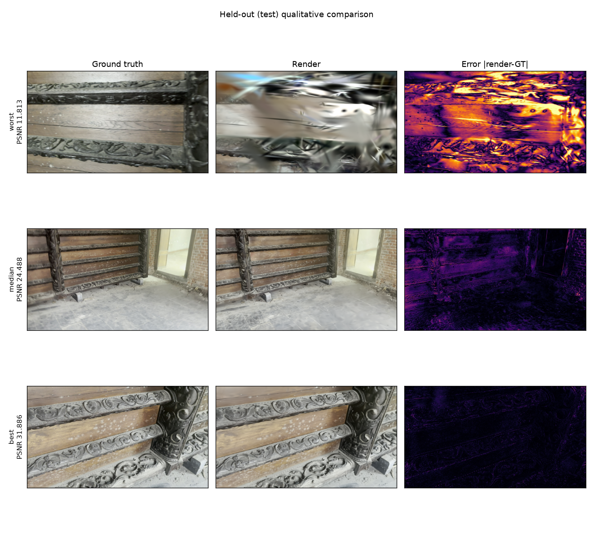
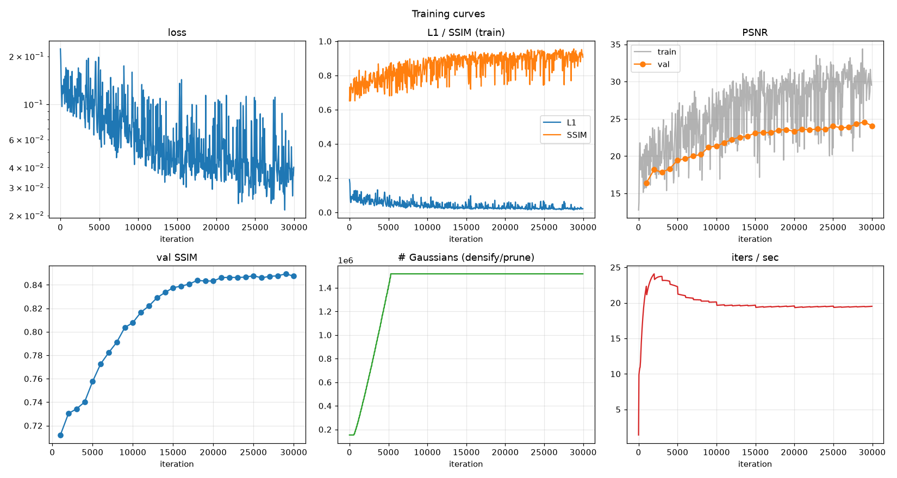
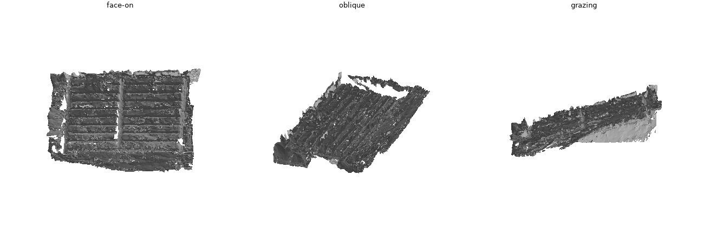

# video_to_3dgs — Pavillon

Raw handheld video → a trained, evaluated, exportable **3D Gaussian Splatting**
reconstruction, orchestrated end-to-end on a Slurm GPU cluster.

<p align="center">
  <br>
  <em>Novel-view orbit of the reconstructed carved ceiling panel (2560px model, 1.24 M Gaussians)</em>
</p>

---

## Executive summary

**The subject.** A carved wooden ceiling panel, stood vertical and filmed handheld
in a room. This capture is close to a worst case for 3DGS: **single-sided** (the
camera never goes around the object), **low-parallax**, **close-range**, and the
subject is a **near-planar relief** whose value is entirely in high-frequency
carving detail.

**The outcome.** A sharp, floater-free reconstruction at **PSNR 24.9 / SSIM 0.862**
with **zero catastrophic views**, exported as a standard `.ply` **and** a fused
triangle mesh of the relief — from a model of only **359 k Gaussians (~90 MB)**.
The whole pipeline is reproducible from one config file.

**What actually moved the needle**, in order of impact:

| # | Change | Effect |
|---|---|---|
| 1 | **Global SfM (GLOMAP)** instead of incremental COLMAP | **181/193** images registered vs **82** — 2.2× coverage |
| 2 | **Two trainer bugs** — scene scale from points not cameras; missing position-LR decay | PSNR **14 → 24**, fog → sharp |
| 3 | **Resolution** — stopped downscaling 4K → 1600px | median PSNR **23.4 → 24.5**, SSIM **0.796 → 0.846**, **282/282** registered |
| 4 | **Anti-floater regularization** | **18.2 % → 0 %** near-transparent haze; max Gaussian scale **1.00 → 0.16** |
| 5 | **Cutting Gaussian capacity 4×** (`cap_max` 1.5M → 375k) | PSNR **23.1 → 24.9**, SSIM **0.846 → 0.862**, catastrophic views **11 % → 0 %**, model **3.5× smaller** |
| 6 | **Per-image appearance embeddings** | unlocks multi-clip merging (**332/332** registered across 2 clips) |

**What did not work**, reported because negative results are cheap to hide and
expensive to rediscover: **2DGS** collapses to flat renders (PSNR ~13) on a
single-sided capture, and **merging a second clip** still loses ~1 dB even with
appearance embeddings.

---

## Metrics study

Every model we trained, grouped by dataset. **Compare only within a group** —
each group has its own SfM solution, held-out split and resolution.

**1600 px dataset** (18 test views)

| Model | Config | PSNR | SSIM | LPIPS | Gaussians |
|---|---|---:|---:|---:|---:|
| Baseline (GLOMAP + 3DGS) | `pavillon_orbit_hq` | **23.9** | **0.825** | **0.245** | 1.53 M |
| A3 regularized | `pavillon_orbit_reg` | 22.3 | 0.796 | 0.290 | 1.22 M |
| A3 ablation (depth off) | `pavillon_orbit_reg_nodepth` | 22.6 | 0.798 | 0.294 | 1.23 M |
| 2DGS backend ❌ | `pavillon_orbit_2dgs` | 13.3 | 0.578 | 0.847 | 0.28 M |

**2560 px dataset** (28 test views) — the capacity sweep

| Model | Config | PSNR | median | SSIM | LPIPS | <18 dB | Gaussians | `.ply` |
|---|---|---:|---:|---:|---:|---:|---:|---:|
| cap 1.5 M · ADC | `..._hidetail` | 23.08 | 24.48 | 0.846 | 0.310 | 11 % | 1.24 M | 295 MB |
| cap 750 k · ADC | `..._hidetail_cap750k` | 24.32 | 25.10 | 0.860 | **0.303** | 11 % | 0.65 M | 162 MB |
| ⭐ **cap 375 k · ADC (recommended)** | `..._hidetail_cap375k` | **24.92** | 25.13 | **0.862** | 0.313 | **0 %** | **0.36 M** | **89 MB** |
| cap 190 k · ADC | `..._hidetail_cap190k` | 24.86 | **25.18** | 0.856 | 0.338 | **0 %** | 0.19 M | 48 MB |
| + pose refinement ❌ | `..._hidetail_poseopt` | 23.94 | 24.40 | 0.829 | 0.330 | 0 % | 0.35 M | 88 MB |
| cap 375 k · **MCMC** (≈tie) | `..._hidetail_mcmc375k` | 24.83 | **25.32** | 0.862 | **0.309** | 0 % | 0.37 M | 91 MB |

**Multi-clip dataset** (2 clips, 33 test views) — appearance embeddings

| Model | Config | PSNR | median | SSIM | LPIPS | <18 dB | Gaussians |
|---|---|---:|---:|---:|---:|---:|---:|
| cap 3.0 M | `pavillon_multiclip_cap3m` | 21.36 | 21.23 | 0.824 | 0.346 | 33 % | 2.50 M |
| cap 1.5 M · ADC | `pavillon_multiclip` | 22.03 | 22.82 | 0.833 | 0.342 | 24 % | 1.23 M |
| cap 750 k · ADC | `pavillon_multiclip_cap750k` | 22.37 | 23.52 | 0.840 | 0.335 | 21 % | 0.64 M |
| **cap 375 k · ADC** | `pavillon_multiclip_cap375k` | **22.99** | **23.44** | **0.847** | 0.335 | **18 %** | 0.33 M |

> ⚠️ **These rows are not all directly comparable.** The high-detail and multi-clip
> models are separate datasets with their own COLMAP, their own held-out splits and
> a different resolution (28–33 test views at 2560px vs 18 at 1600px). PSNR and
> LPIPS in particular shift with image resolution. Where resolutions differ we
> compare **distributions**, not single numbers.

**Distribution comparison** (the honest one — larger, harder split, and it still wins):

| | A3 @1600px | High-detail @2560px |
|---|---:|---:|
| median PSNR | 23.43 | **24.48** |
| mean SSIM | 0.796 | **0.846** |
| best view | 26.5 | **31.9** |
| catastrophic views (<18 dB) | 3/18 (17 %) | 3/28 (**11 %**) |

### Reading these metrics

The three metrics disagree by design, and the disagreements are the interesting part:

- **PSNR** is mean-squared-error in disguise. It rewards blur and is dominated by
  low-frequency agreement — and it is very sensitive to a global brightness shift.
- **SSIM** compares local luminance/contrast/structure. For a *relief* subject this
  is the metric that tracks what we care about, and it is largely blind to global
  photometric offsets.
- **LPIPS** compares deep features and best matches human judgement.

Two cases where this mattered concretely:

1. **The A3 regularizers lower PSNR by ~1.4 dB while making the model objectively
   cleaner** (18 % of Gaussians removed as haze). An ablation showed the cost is the
   *final opacity prune*, **not** the depth prior — which only accounts for 0.26 dB.
2. **A 4 dB "regression" that was mostly a measurement bug.** The multi-clip model
   scored 19.0 until we noticed `evaluate` rendered without restoring the appearance
   model — scoring the *uncorrected* output while training optimised corrected ones.
   Fixing it gave **+3.02 dB** (→ 22.0). The tell was that **PSNR collapsed while
   SSIM barely moved**, which is the signature of a global photometric offset rather
   than broken geometry.

3. **More capacity made the model worse — and less made it much better.** See below.

### Gaussian capacity is a regularizer, not a quality dial

The single largest late-stage gain came from making the model *smaller*. Everything
below is the same dataset, same regularizers, same 30 k iterations — only `cap_max`
changes:

| `cap_max` | Gaussians | PSNR | median | SSIM | LPIPS | catastrophic (<18 dB) |
|---|---:|---:|---:|---:|---:|---:|
| 3.0 M* | 2.50 M | 21.4* | — | 0.824* | 0.346* | 33 %* |
| 1.5 M | 1.24 M | 23.08 | 24.48 | 0.846 | 0.310 | 11 % |
| 750 k | 0.65 M | 24.32 | 25.10 | 0.860 | **0.303** | 11 % |
| ⭐ **375 k** | **0.36 M** | **24.92** | 25.13 | **0.862** | 0.313 | **0 %** |
| 190 k | 0.19 M | 24.86 | **25.18** | 0.856 | 0.338 | **0 %** |

<sub>*the 3.0 M row is from the multi-clip dataset, where the doubling experiment was run.</sub>

<p align="center">
  <br>
  <em>Five capacity points, everything else held fixed. PSNR and SSIM peak at 375 k;
  LPIPS bottoms at 750 k; the catastrophic-view tail vanishes at ≤375 k.</em>
</p>

Cutting the budget 4× raised PSNR by **1.8 dB**, improved SSIM, **eliminated the
catastrophic-view tail entirely**, and shrank the model **3.5×**.

**Why:** with a single-sided, low-parallax capture the reconstruction is
underdetermined — depth is constrained only by *disagreement* between views, and
there is little. Every extra Gaussian is another parameter free to sit at a wrong
depth while still reproducing the training images, so surplus capacity buys
solutions that fit training views and fail on held-out ones. Classic overfitting,
in a place where one does not usually think to look for it.

**How we found it:** by being wrong. We first hypothesised the opposite — that a
multi-clip model was starved of capacity — and *raised* `cap_max` to 3.0 M. It got
worse, which falsified the hypothesis and pointed the other way. Testing the
reversed direction produced the biggest quality gain since the resolution fix.

The curve genuinely turns rather than running away: at 190 k both PSNR and SSIM fall
back, so **375 k is the optimum**, not merely the smallest thing tested. The metrics
disagree in a way that is itself informative — **LPIPS bottoms at 750 k** and degrades
monotonically as capacity shrinks, i.e. perceptual detail wants capacity while
accuracy and generalisation want less. Pick 375 k for accuracy and robustness, 750 k
if perceptual fidelity of the carving matters most.

**Aggregate means hide the failure structure.** Per-view analysis is what diagnosed
the biggest win: every catastrophic view was an extreme close-up at grazing
incidence, which identified a *spatial-frequency deficit* (we were throwing away 4K
detail) and motivated the high-detail run.

<p align="center">
  <br>
  <em>Per-view metrics — the tail, not the mean, is where the diagnosis lives</em>
</p>

---

## Visual results

<p align="center">
  <br>
  <em>Held-out views: ground truth │ render │ error map</em>
</p>

<p align="center">
  <br>
  <em><b>Anti-floater regularization.</b> Baseline (top) sprays a diffuse streak of
  faint Gaussians toward the cameras; the regularized model (bottom) is a tight,
  solid cluster. Median opacity 0.51 → 0.88, max scale 1.00 → 0.16.</em>
</p>

<p align="center">
  
</p>

### Surface mesh

<p align="center">
  <br>
  <em>TSDF-fused triangle mesh — the panel's planks and carved cross-members are
  resolved. Adding depth-normal consistency (`train.normal_consistency`) raises surface
  normal coherence from 0.81 to 0.92.</em>
</p>

`export` also writes `mesh.ply`, produced by fusing the model's own composited depth
over all training cameras. Two honest caveats: volumetric Gaussians give a **biased**
expected depth (a Gaussian straddling a surface contributes mass on both sides), so
the mesh is geometrically softer than a surface-aligned method would give; and the
fusion covers the whole scene, so surrounding wall and floor are included. 2DGS is
the principled route to surfaces but fails on this capture — see the negative result
above.

Every run also writes `videos/orbit.mp4` (front-arc novel-view sweep) and
`videos/training_progression.mp4` (reconstruction quality over iterations). These
are run artifacts and are not committed — the pipeline regenerates them.

---

## Further experiments (implemented, mostly informative nulls)

Three evidence-ranked follow-ups from the literature review. All are config flags; none
required changing the deliverable.

| Experiment | Flag | Result |
|---|---|---|
| **3DGS-MCMC** densification | `densification.strategy: mcmc` | **Tie** with the heuristic at the same budget (−0.09 ± 0.45 dB). Confirms the capacity gain is about the *budget*, not how it's allocated. Preferred default operationally — no `grad_threshold`. |
| **Depth–normal consistency** | `train.normal_consistency` | Renders unchanged (+0.06 ± 0.21 dB), but the extracted **mesh is cleaner**: normal coherence 0.81 → **0.92**, 32 % fewer vertices. Turn it on when you want a mesh. |
| **Bilateral-grid appearance** | `appearance_model: bilateral` | **Tie** with the affine model (−0.15 ± 0.37 dB) — this capture has no *spatially varying* response, only a global exposure shift the affine map already fixes (grid drift 0.013 vs 0.072). |
| **Multi-clip at 375 k** | `pavillon_multiclip_cap375k` | The merge's **best** result (22.99). Correct capacity recovered the original clip's views to parity with the added clip — most of the earlier merge deficit was budget dilution, not the merge. |
| **Pose refinement** | `train.pose_optimization` | **−1 dB.** GLOMAP's poses were already 0.92 px; there was no error to recover. |

All differences within a dataset that fall inside ±~0.45 dB are reported as ties, not
wins — with 28–33 test views the paired confidence interval is that wide, and reporting
a mean-only "winner" would overclaim.

## Settings of the recommended model

One YAML file, no code changes (`configs/pipeline/pavillon_orbit_hidetail_cap375k.yaml`):

| Stage | Setting | Value |
|---|---|---|
| Frames | sampling / resolution | 4 fps, ≤400 frames · long edge **2560 px** (source is 3840×2160) |
| | blur filter | var-of-Laplacian ≥ 50, measured at a **fixed 1600 px reference scale** → 282/400 kept |
| SfM | matcher / mapper | exhaustive · **GLOMAP** (global) |
| | result | **282/282 registered**, 0.985 px reproj., 152 792 points |
| Split | pose-aware | 226 train / 28 val / 28 test |
| Train | backend / iters / SH | `gsplat` · 30 k · degree 3 |
| | **capacity** | `cap_max` = **375 k** ← the single most important knob |
| | densification | grad 3e-4, interval 100, iters 500–15 000, opacity reset 3000 |
| | room bounds | AABB(cameras ∪ points) × 1.5, every 500 steps |
| | anti-floater | scale > 0.15·extent suppressed; final prune below opacity 0.005 |
| | depth prior | DepthAnything-v2-Small, Pearson loss, weight 0.1, from iter 2000 |

Outputs: `point_cloud.ply` (89 MB) · `mesh.ply` (952 k verts) · orbit + progression
videos · 5 figures · `eval.json` · a row in `experiments/registry.csv`.

## Quickstart

```bash
# 0. one-time environment (torch cu128/cu130 + gsplat + COLMAP/GLOMAP)
scripts/bootstrap_environment.sh

# 1. verify the target GPU node actually works (drivers here are inconsistent)
srun --partition=rtxpro --nodelist=GPURACK2 --gres=gpu:1 --time=00:25:00 \
  bash -lc 'export MAX_JOBS=4; source scripts/_activate_env.sh; python scripts/gsplat_selftest.py'

# 2. full reconstruction: extract → filter → GLOMAP → normalize → split
#    → train → evaluate → export → visualize
sbatch scripts/slurm/train.sbatch configs/pipeline/pavillon_orbit_hidetail.yaml

# 3. train a sibling model on the SAME reconstruction (skips the expensive SfM)
sbatch scripts/slurm/train.sbatch configs/pipeline/pavillon_orbit_reg.yaml \
       --force --from-stage train
```

Per-stage control, all with `--dry-run / --force / --resume / --verbose / --set k=v`:

```bash
python -m video_to_3dgs.cli inspect-env --gpu-check      # driver, sm_120, gsplat smoke test
python -m video_to_3dgs.cli extract-frames --config <cfg>
python -m video_to_3dgs.cli reconstruct    --config <cfg>   # COLMAP / GLOMAP
python -m video_to_3dgs.cli train          --config <cfg>
python -m video_to_3dgs.cli evaluate       --config <cfg>   # held-out only
python -m video_to_3dgs.cli export         --config <cfg>   # .ply + cameras + transforms
python -m video_to_3dgs.cli run-all        --config <cfg> [--from-stage S --only S]
python -m video_to_3dgs.cli status         --config <cfg>
```

Analysis utilities:

```bash
python scripts/floater_spatial.py <dataset_id> <a.ply> <b.ply> out.png   # floater comparison, CPU-only
python scripts/gsplat_selftest.py                                        # per-node CUDA/gsplat check
```

---

## How it works

```
video → inspect → extract frames → quality filter → [masks] → COLMAP/GLOMAP
      → validate → normalize → pose-aware split → train (gsplat) → evaluate
      → export (.ply) → report (figures + videos)
```

The **filesystem is the source of truth** — no daemon, no database. Each stage is
the only writer of its own status file and reaches `COMPLETED` only after its
outputs validate, so a crash never leaves a false success. A fingerprint over
(parameters + input checksums) drives skip/rerun and invalidates downstream stages
automatically. Training checkpoints atomically and resumes from the latest valid
checkpoint; SIGTERM flushes a checkpoint and exits 0 for Slurm requeue.

**Techniques implemented** beyond vanilla 3DGS:

| Technique | Knob | Notes |
|---|---|---|
| Global SfM | `run_colmap.mapper_backend: glomap` | 2.2× registration on low-overlap capture |
| Room bounds | `train.bounds` | constrains Gaussians to the captured volume |
| Anti-floater | `train.floater` | scale/opacity suppression + final hard prune |
| Monocular depth prior | `train.depth_prior` | DepthAnything-v2 + scale-invariant Pearson loss |
| Appearance embeddings | `train.appearance_embedding` | per-image latent → affine colour transform |
| 2DGS surface backend | `train.backend: 2dgs` | implemented; underperforms on this capture |

---

## Documentation

- **[docs/reproduce_pavillon.md](docs/reproduce_pavillon.md)** — reproduce the model end-to-end (start here)
- **[docs/report/theory.tex](docs/report/theory.tex)** — cited theory: representation, EWA projection, compositing, density control, depth priors, appearance modelling
- [docs/pipeline_architecture.md](docs/pipeline_architecture.md) · [docs/colmap_guide.md](docs/colmap_guide.md) · [docs/capture_guide.md](docs/capture_guide.md) · [docs/troubleshooting.md](docs/troubleshooting.md)
- [state/decisions.md](state/decisions.md) — every technical decision with its evidence, **including retractions**

## Capture advice (learned the hard way)

The single biggest determinant of quality is **coverage**, and no amount of
regularization recovers a surface that only one camera saw well. When filming:
orbit the object rather than panning, vary elevation, keep generous overlap
between consecutive frames, lock exposure/white-balance if you can, and avoid
extreme close-ups at grazing incidence — those were every one of our worst
reconstructed views.
