# video_to_3dgs

Raw handheld video → a trained, evaluated, exportable **3D Gaussian Splatting**
reconstruction, orchestrated end-to-end on a Slurm GPU cluster. Built and validated on
two deliberately opposite captures, so the framework and its findings are tested for
*transfer*, not tuned to one scene.

<p align="center">
  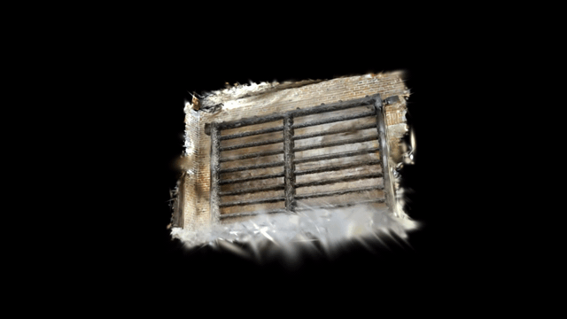<br>
  <em>Novel-view orbit of the reconstructed carved ceiling panel
  (recommended 2560 px model, 359 k Gaussians)</em>
</p>

## The two captures

| | **Pavillon** | **Casque Saint-Georges** |
|---|---|---|
| Subject | carved relief **in a wall** | free-standing **reflective helmet** |
| Camera path | **single-sided**, low parallax | **full orbit**, high parallax |
| Sources | one iPhone clip | pro camera **+** iPhone |
| Reconstruction | 24.9 PSNR / 0.862 SSIM, 0 % catastrophic | helmet sharp; scene 22.1 PSNR (533 views) |
| Recipe | [docs/reproduce_pavillon.md](docs/reproduce_pavillon.md) | [docs/reproduce_casque.md](docs/reproduce_casque.md) |

They sit at opposite ends of almost every axis, which is the point: several techniques
that help one **invert** on the other. **[docs/technique_transfer.md](docs/technique_transfer.md)**
tracks every technique and whether it transferred — the most useful single page if you
are adapting this to a new capture.

---

## Case study 1 — Pavillon (executive summary)

**The subject.** A carved wooden ceiling panel, stood vertical and filmed handheld
in a room. This capture is close to a worst case for 3DGS: **single-sided** (the
camera never goes around the object), **low-parallax**, **close-range**, and the
subject is a **near-planar relief** whose value is entirely in high-frequency
carving detail.

**The outcome.** A sharp, floater-free reconstruction at **PSNR 24.9 / SSIM 0.862**
with **zero catastrophic views**, exported as a standard `.ply` **and** a fused
triangle mesh of the relief — from a model of only **359 k Gaussians (~90 MB)**.
The whole pipeline is reproducible from one config file.

**What actually moved the needle**, in order of impact:

| # | Change | Effect |
|---|---|---|
| 1 | **Global SfM (GLOMAP)** instead of incremental COLMAP | **181/193** images registered vs **82** — 2.2× coverage |
| 2 | **Two trainer bugs** — scene scale from points not cameras; missing position-LR decay | PSNR **14 → 24**, fog → sharp |
| 3 | **Resolution** — stopped downscaling 4K → 1600px | median PSNR **23.4 → 24.5**, SSIM **0.796 → 0.846**, **282/282** registered |
| 4 | **Anti-floater regularization** | **18.2 % → 0 %** near-transparent haze; max Gaussian scale **1.00 → 0.16** |
| 5 | **Cutting Gaussian capacity 4×** (`cap_max` 1.5M → 375k) | PSNR **23.1 → 24.9**, SSIM **0.846 → 0.862**, catastrophic views **11 % → 0 %**, model **3.5× smaller** |
| 6 | **Per-image appearance embeddings** | unlocks multi-clip merging (**332/332** registered across 2 clips) |

**What did not work**, reported because negative results are cheap to hide and
expensive to rediscover: **2DGS** collapses to flat renders (PSNR ~13) on a
single-sided capture; **pose refinement** costs 1 dB (SfM was already sub-pixel); and
**a generative diffusion prior** (FixingGS/Difix-style) moves renders *away* from
ground truth at every strength — those methods fix the extreme-sparse regime where the
reconstruction is broken, and ours (226 views, 24.9 dB) has no gap to fill, only detail
to corrupt.

---

## Metrics study

Every model we trained, grouped by dataset. **Compare only within a group** —
each group has its own SfM solution, held-out split and resolution.

**1600 px dataset** (18 test views)

| Model | Config | PSNR | SSIM | LPIPS | Gaussians |
|---|---|---:|---:|---:|---:|
| Baseline (GLOMAP + 3DGS) | `pavillon_orbit_hq` | **23.9** | **0.825** | **0.245** | 1.53 M |
| A3 regularized | `pavillon_orbit_reg` | 22.3 | 0.796 | 0.290 | 1.22 M |
| A3 ablation (depth off) | `pavillon_orbit_reg_nodepth` | 22.6 | 0.798 | 0.294 | 1.23 M |
| 2DGS backend ❌ | `pavillon_orbit_2dgs` | 13.3 | 0.578 | 0.847 | 0.28 M |

**2560 px dataset** (28 test views) — the capacity sweep

| Model | Config | PSNR | median | SSIM | LPIPS | <18 dB | Gaussians | `.ply` |
|---|---|---:|---:|---:|---:|---:|---:|---:|
| cap 1.5 M · ADC | `..._hidetail` | 23.08 | 24.48 | 0.846 | 0.310 | 11 % | 1.24 M | 295 MB |
| cap 750 k · ADC | `..._hidetail_cap750k` | 24.32 | 25.10 | 0.860 | **0.303** | 11 % | 0.65 M | 162 MB |
| ⭐ **cap 375 k · ADC (recommended)** | `..._hidetail_cap375k` | **24.92** | 25.13 | **0.862** | 0.313 | **0 %** | **0.36 M** | **89 MB** |
| cap 190 k · ADC | `..._hidetail_cap190k` | 24.86 | **25.18** | 0.856 | 0.338 | **0 %** | 0.19 M | 48 MB |
| + pose refinement ❌ | `..._hidetail_poseopt` | 23.94 | 24.40 | 0.829 | 0.330 | 0 % | 0.35 M | 88 MB |
| cap 375 k · **MCMC** (≈tie) | `..._hidetail_mcmc375k` | 24.83 | **25.32** | 0.862 | **0.309** | 0 % | 0.37 M | 91 MB |

**Multi-clip dataset** (2 clips, 33 test views) — appearance embeddings

| Model | Config | PSNR | median | SSIM | LPIPS | <18 dB | Gaussians |
|---|---|---:|---:|---:|---:|---:|---:|
| cap 3.0 M | `pavillon_multiclip_cap3m` | 21.36 | 21.23 | 0.824 | 0.346 | 33 % | 2.50 M |
| cap 1.5 M · ADC | `pavillon_multiclip` | 22.03 | 22.82 | 0.833 | 0.342 | 24 % | 1.23 M |
| cap 750 k · ADC | `pavillon_multiclip_cap750k` | 22.37 | 23.52 | 0.840 | 0.335 | 21 % | 0.64 M |
| **cap 375 k · ADC** | `pavillon_multiclip_cap375k` | **22.99** | **23.44** | **0.847** | 0.335 | **18 %** | 0.33 M |

> ⚠️ **These rows are not all directly comparable.** The high-detail and multi-clip
> models are separate datasets with their own COLMAP, their own held-out splits and
> a different resolution (28–33 test views at 2560px vs 18 at 1600px). PSNR and
> LPIPS in particular shift with image resolution. Where resolutions differ we
> compare **distributions**, not single numbers.

**Distribution comparison** (the honest one — larger, harder split, and it still wins):

| | A3 @1600px | High-detail @2560px |
|---|---:|---:|
| median PSNR | 23.43 | **24.48** |
| mean SSIM | 0.796 | **0.846** |
| best view | 26.5 | **31.9** |
| catastrophic views (<18 dB) | 3/18 (17 %) | 3/28 (**11 %**) |

### Reading these metrics

The three metrics disagree by design, and the disagreements are the interesting part:

- **PSNR** is mean-squared-error in disguise. It rewards blur and is dominated by
  low-frequency agreement — and it is very sensitive to a global brightness shift.
- **SSIM** compares local luminance/contrast/structure. For a *relief* subject this
  is the metric that tracks what we care about, and it is largely blind to global
  photometric offsets.
- **LPIPS** compares deep features and best matches human judgement.

Two cases where this mattered concretely:

1. **The A3 regularizers lower PSNR by ~1.4 dB while making the model objectively
   cleaner** (18 % of Gaussians removed as haze). An ablation showed the cost is the
   *final opacity prune*, **not** the depth prior — which only accounts for 0.26 dB.
2. **A 4 dB "regression" that was mostly a measurement bug.** The multi-clip model
   scored 19.0 until we noticed `evaluate` rendered without restoring the appearance
   model — scoring the *uncorrected* output while training optimised corrected ones.
   Fixing it gave **+3.02 dB** (→ 22.0). The tell was that **PSNR collapsed while
   SSIM barely moved**, which is the signature of a global photometric offset rather
   than broken geometry.

3. **More capacity made the model worse — and less made it much better.** See below.

### Gaussian capacity is a regularizer, not a quality dial

The single largest late-stage gain came from making the model *smaller*. Everything
below is the same dataset, same regularizers, same 30 k iterations — only `cap_max`
changes:

| `cap_max` | Gaussians | PSNR | median | SSIM | LPIPS | catastrophic (<18 dB) |
|---|---:|---:|---:|---:|---:|---:|
| 3.0 M* | 2.50 M | 21.4* | — | 0.824* | 0.346* | 33 %* |
| 1.5 M | 1.24 M | 23.08 | 24.48 | 0.846 | 0.310 | 11 % |
| 750 k | 0.65 M | 24.32 | 25.10 | 0.860 | **0.303** | 11 % |
| ⭐ **375 k** | **0.36 M** | **24.92** | 25.13 | **0.862** | 0.313 | **0 %** |
| 190 k | 0.19 M | 24.86 | **25.18** | 0.856 | 0.338 | **0 %** |

<sub>*the 3.0 M row is from the multi-clip dataset, where the doubling experiment was run.</sub>

<p align="center">
  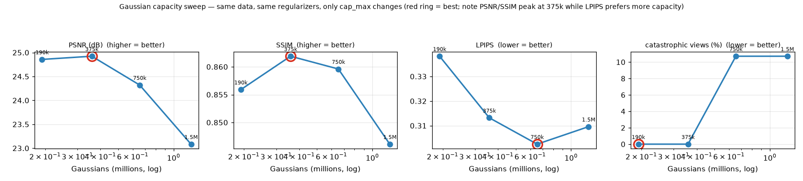<br>
  <em>Five capacity points, everything else held fixed. PSNR and SSIM peak at 375 k;
  LPIPS bottoms at 750 k; the catastrophic-view tail vanishes at ≤375 k.</em>
</p>

Cutting the budget 4× raised PSNR by **1.8 dB**, improved SSIM, **eliminated the
catastrophic-view tail entirely**, and shrank the model **3.5×**.

**Why:** with a single-sided, low-parallax capture the reconstruction is
underdetermined — depth is constrained only by *disagreement* between views, and
there is little. Every extra Gaussian is another parameter free to sit at a wrong
depth while still reproducing the training images, so surplus capacity buys
solutions that fit training views and fail on held-out ones. Classic overfitting,
in a place where one does not usually think to look for it.

**How we found it:** by being wrong. We first hypothesised the opposite — that a
multi-clip model was starved of capacity — and *raised* `cap_max` to 3.0 M. It got
worse, which falsified the hypothesis and pointed the other way. Testing the
reversed direction produced the biggest quality gain since the resolution fix.

The curve genuinely turns rather than running away: at 190 k both PSNR and SSIM fall
back, so **375 k is the optimum**, not merely the smallest thing tested. The metrics
disagree in a way that is itself informative — **LPIPS bottoms at 750 k** and degrades
monotonically as capacity shrinks, i.e. perceptual detail wants capacity while
accuracy and generalisation want less. Pick 375 k for accuracy and robustness, 750 k
if perceptual fidelity of the carving matters most.

**Aggregate means hide the failure structure.** Per-view analysis is what diagnosed
the biggest win: every catastrophic view was an extreme close-up at grazing
incidence, which identified a *spatial-frequency deficit* (we were throwing away 4K
detail) and motivated the high-detail run.

<p align="center">
  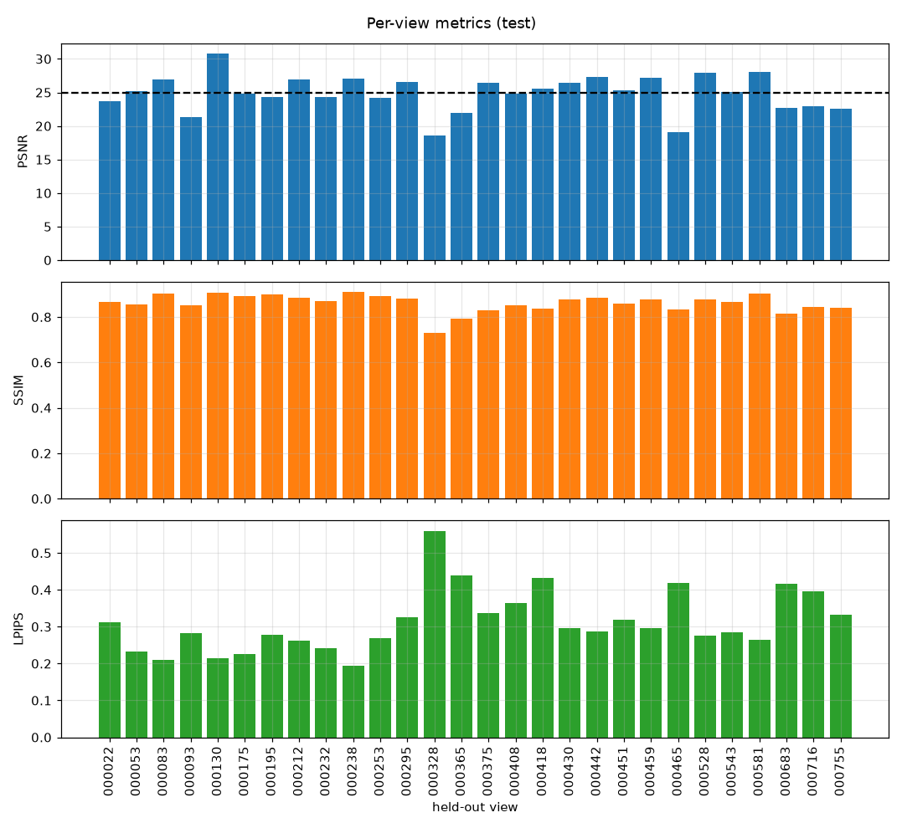<br>
  <em>Per-view metrics — the tail, not the mean, is where the diagnosis lives</em>
</p>

---

## Visual results

<p align="center">
  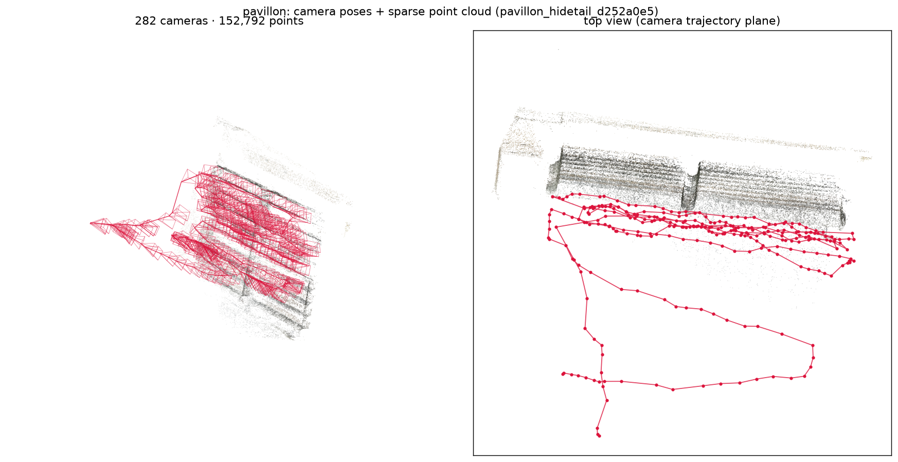<br>
  <em><b>Where reconstruction starts.</b> The GLOMAP solution: 282 registered
  cameras (red frusta) sweeping handheld arcs in front of the panel, and the
  153 k-point sparse cloud they triangulate. Left: 3D view from behind the
  cameras; right: top view in the camera-trajectory plane.</em>
</p>

<p align="center">
  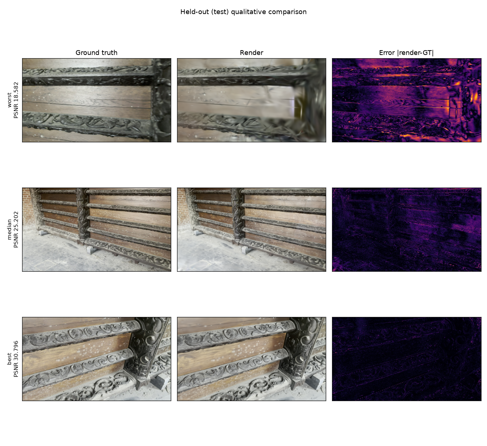<br>
  <em>Held-out views: ground truth │ render │ error map</em>
</p>

<p align="center">
  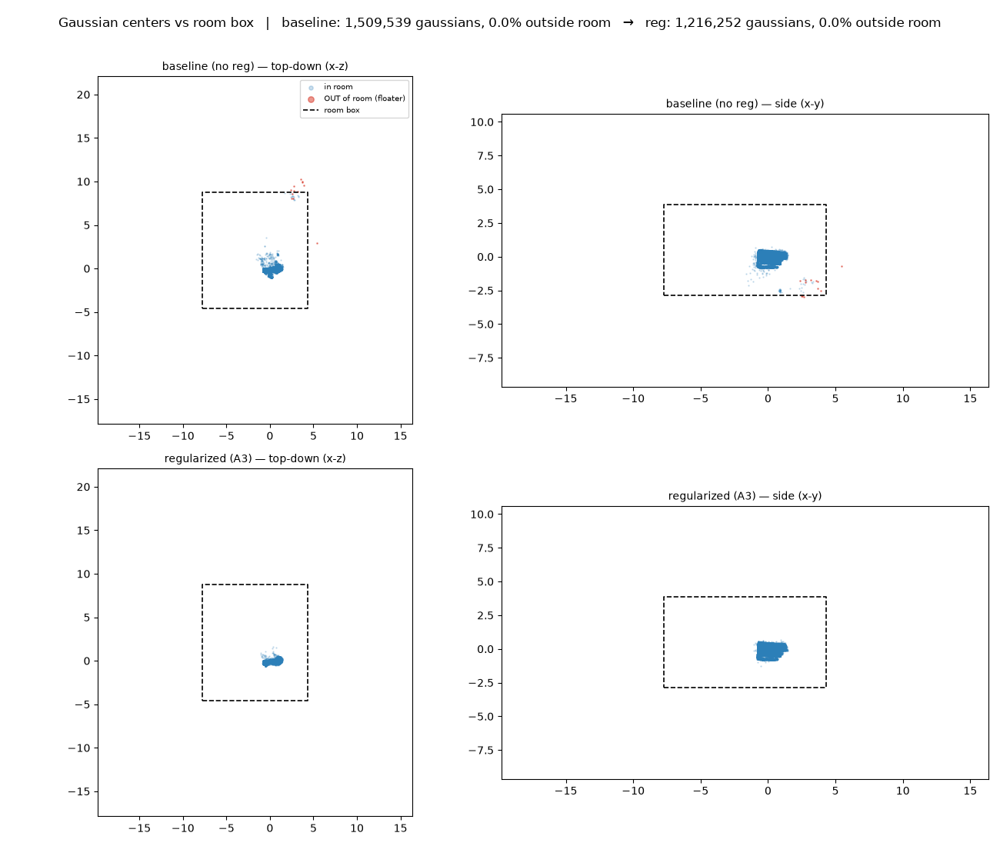<br>
  <em><b>Anti-floater regularization.</b> Baseline (top) sprays a diffuse streak of
  faint Gaussians toward the cameras; the regularized model (bottom) is a tight,
  solid cluster. Median opacity 0.51 → 0.88, max scale 1.00 → 0.16.</em>
</p>

<p align="center">
  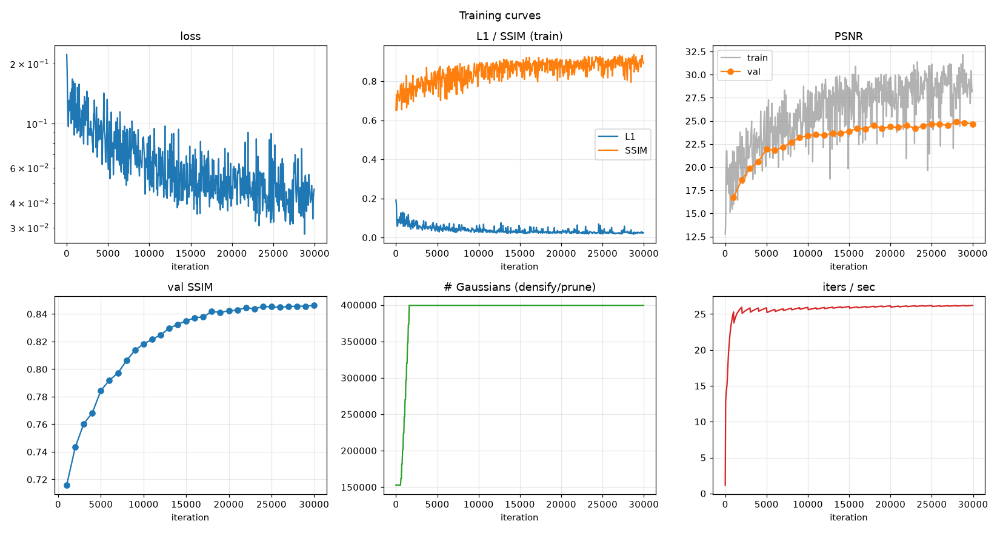
</p>

### Surface mesh

<p align="center">
  <br>
  <em>TSDF-fused triangle mesh — the panel's planks and carved cross-members are
  resolved. Adding depth-normal consistency (`train.normal_consistency`) raises surface
  normal coherence from 0.81 to 0.92.</em>
</p>

`export` also writes `mesh.ply`, produced by fusing the model's own composited depth
over all training cameras. Two honest caveats: volumetric Gaussians give a **biased**
expected depth (a Gaussian straddling a surface contributes mass on both sides), so
the mesh is geometrically softer than a surface-aligned method would give; and the
fusion covers the whole scene, so surrounding wall and floor are included. 2DGS is
the principled route to surfaces but fails on this capture — see the negative result
above.

Every run also writes `videos/orbit.mp4` (front-arc novel-view sweep) and
`videos/training_progression.mp4` (reconstruction quality over iterations). These
are run artifacts and are not committed — the pipeline regenerates them.

---

## Further experiments (implemented, mostly informative nulls)

Three evidence-ranked follow-ups from the literature review. All are config flags; none
required changing the deliverable.

| Experiment | Flag | Result |
|---|---|---|
| **3DGS-MCMC** densification | `densification.strategy: mcmc` | **Tie** with the heuristic at the same budget (−0.09 ± 0.45 dB). Confirms the capacity gain is about the *budget*, not how it's allocated. Preferred default operationally — no `grad_threshold`. |
| **Depth–normal consistency** | `train.normal_consistency` | Renders unchanged (+0.06 ± 0.21 dB), but the extracted **mesh is cleaner**: normal coherence 0.81 → **0.92**, 32 % fewer vertices. Turn it on when you want a mesh. |
| **Bilateral-grid appearance** | `appearance_model: bilateral` | **Tie** with the affine model (−0.15 ± 0.37 dB) — this capture has no *spatially varying* response, only a global exposure shift the affine map already fixes (grid drift 0.013 vs 0.072). |
| **Multi-clip at 375 k** | `pavillon_multiclip_cap375k` | The merge's **best** result (22.99). Correct capacity recovered the original clip's views to parity with the added clip — most of the earlier merge deficit was budget dilution, not the merge. |
| **Pose refinement** | `train.pose_optimization` | **−1 dB.** GLOMAP's poses were already 0.92 px; there was no error to recover. |
| **Generative diffusion prior** | `scripts/diffusion_refine_test.py` | **Worse at every strength** (24.9 → 24.3 → 22.5 vs GT). Helps broken sparse reconstructions, not a good one — it hallucinates generic detail. |

All differences within a dataset that fall inside ±~0.45 dB are reported as ties, not
wins — with 28–33 test views the paired confidence interval is that wide, and reporting
a mean-only "winner" would overclaim.

## Settings of the recommended model

One YAML file, no code changes (`configs/pipeline/pavillon/pavillon_orbit_hidetail_cap375k.yaml`):

| Stage | Setting | Value |
|---|---|---|
| Frames | sampling / resolution | 4 fps, ≤400 frames · long edge **2560 px** (source is 3840×2160) |
| | blur filter | var-of-Laplacian ≥ 50, measured at a **fixed 1600 px reference scale** → 282/400 kept |
| SfM | matcher / mapper | exhaustive · **GLOMAP** (global) |
| | result | **282/282 registered**, 0.985 px reproj., 152 792 points |
| Split | pose-aware | 226 train / 28 val / 28 test |
| Train | backend / iters / SH | `gsplat` · 30 k · degree 3 |
| | **capacity** | `cap_max` = **375 k** ← the single most important knob |
| | densification | grad 3e-4, interval 100, iters 500–15 000, opacity reset 3000 |
| | room bounds | AABB(cameras ∪ points) × 1.5, every 500 steps |
| | anti-floater | scale > 0.15·extent suppressed; final prune below opacity 0.005 |
| | depth prior | DepthAnything-v2-Small, Pearson loss, weight 0.1, from iter 2000 |

Outputs: `point_cloud.ply` (89 MB) · `mesh.ply` (952 k verts) · orbit + progression
videos · 5 figures · `eval.json` · a row in `experiments/registry.csv`.

---

## Case study 2 — Casque (a different capture)

A full **orbit** of a free-standing **chrome dragoon helmet** (plume, on a stand, on a
checkerboard, in an auditorium), shot with a **pro camera and an iPhone**. The point of
this second object is *transfer*: does the framework, and do the Pavillon findings,
carry to the opposite geometry? See
**[docs/technique_transfer.md](docs/technique_transfer.md)** for the full matrix and
**[docs/reproduce_casque.md](docs/reproduce_casque.md)** for the recipe.

**What the framework did well, unchanged:** GLOMAP registered **533/536** images across
4 clips and two camera types at 1.57 px (the checkerboard, which we kept *unmasked*,
made cross-clip alignment easy); the helmet reconstructs cleanly — sharp gold crest,
*plausible chrome* (SH degree 3 on a genuinely hard reflective surface), soft plume.

**Three framework-aware decisions that inverted the Pavillon defaults:**

1. **Masks off, not on.** The obvious "I only want the helmet → mask it" backfires:
   rembg swung 0.1–45 % across the orbit (chrome + wispy plume + stand), and masking
   would have deleted the checkerboard — the best SfM features present. So: reconstruct
   the full scene, isolate the free-standing helmet **in 3D** afterwards (crop).
2. **The object box is a negative.** Concentrating the budget on the helmet with an
   explicit box (`train.bounds.box_center`) did **not** sharpen it — same PSNR, plus
   radial boundary smearing. The helmet is **data-limited, not budget-limited** — the
   mirror of the Pavillon capacity finding. Isolate by cropping, not by pruning.
3. **Aggregate metrics mislead more than usual.** Multi-clip *raised* PSNR (20.4 → 22.1)
   but the montage shows why: the added clips are **wide** shots where the *room*
   dominates the frame, so the gain is environment, not helmet. The helmet detail comes
   from the one close-up 4K clip.

<p align="center">
  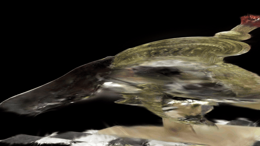<br>
  <em>360° turntable of the reconstructed helmet (1.5 M Gaussians), cropped to the
  subject. The novel-view path and the crop box are both derived from the measured
  rig geometry — see <a href="#novel-view-paths-are-chosen-from-measured-rig-geometry">below</a>.</em>
</p>

### The three transfer tests — results

The whole point of a second, opposite capture is to find out which Pavillon findings are
*laws* and which were properties of that capture. All three predictions have now been
measured, and **two of the three surprised us**.

| Prediction | Outcome | Measured |
|---|---|---|
| Capacity "less is more" **inverts** | ✅ **confirmed** | optimum 375 k → **1.5 M** |
| **2DGS should work** on a real orbit | ✅ confirmed, after a fix | 15.79 → **20.19 dB**, ties 3DGS |
| Pose refinement **may help** (1.57 px poses) | ❌ **falsified** | **−0.54 dB**, CI [−0.71, −0.36] |

**1. Capacity inverts — the single most transferable lesson.**

<p align="center">
  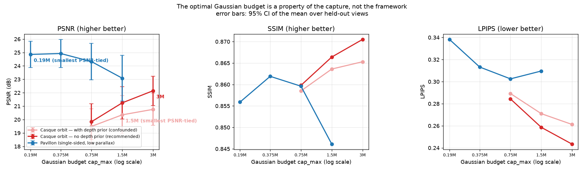<br>
  <em>The same sweep on both objects. The curves run in opposite directions: the
  low-parallax Pavillon degrades with capacity, the orbit improves with it. The pale red
  series is the same orbit sweep measured with a depth prior that turned out to be
  harmful — kept visible because it changed the curve's <em>shape</em>.
  Regenerate with <code>python scripts/capacity_curve.py</code>.</em>
</p>

| Casque `cap_max` | 750 k | 1.5 M | 3 M | **6 M** | 12 M |
|---|---|---|---|---|---|
| PSNR *(with depth prior — confounded)* | 19.49 | 20.35 | 20.76 | — | — |
| **PSNR (no depth prior — recommended)** | 19.84 | 21.25 | 22.15 | **23.41** | 23.27 |

Judged *paired* per view, with the prior removed, **three successive doublings are all
significant**: 750 k → 1.5 M **+1.41 dB** (12/13), 1.5 M → 3 M **+0.90 dB** (11/13),
3 M → 6 M **+1.26 dB** (12/13). Then it stops: 6 M → 12 M is **−0.14 dB, CI
[−0.69, +0.41]** (7/13) — a tie. **6 M is the operating point**, with 12 M tied at twice
the size. Each run really spends its budget (all end at ~88 % of cap, the rest being the
final opacity prune), so this is a genuine ceiling, not slow saturation.

So the two captures differ by **16×** in optimal budget: **375 k vs 6 M** — a 3.8 GB
checkpoint against the Pavillon's 90 MB.

**But the object is not what needs the capacity.** Re-running the identical pipeline with
the loss masked to the helmet flattens the curve completely:

| masked `cap_max` | 190 k | 375 k | 750 k | 1.5 M | 6 M |
|---|---|---|---|---|---|
| PSNR | 22.81 | 23.10 | 23.03 | 22.96 | 23.06 |

Every step is a tie across a **32× range**, while the same pipeline on the full frame gained
significantly at every doubling. So the honest statement is not "capacity inverts between
captures" but **the Gaussian budget is set by how much observed scene the loss must
reproduce**: one wall → 375 k, an auditorium → 6 M, the helmet alone → **≤190 k** — below
the Pavillon's optimum, despite this being the higher-parallax capture.

Practically: if you only want the object, masking the loss buys a **30× smaller model at no
measurable cost** (190 k vs 5.3 M Gaussians; ~50 MB vs 3.8 GB). (Masked PSNR is not
comparable in absolute terms to unmasked — different pixel population; only the shape is.)

**The claim was then tested in the opposite direction.** If capacity tracks how much scene
the loss must reproduce, *widening* the mask should bring the capacity effect back. Masking
helmet **+ checkerboard base**:

| masked region | 375 k → 1.5 M |
|---|---|
| helmet only | tie (as is every step, 190 k–6 M) |
| **helmet + board** | **+1.97 dB**, CI [+1.29, +2.65], 13/13 views |

Capacity goes from irrelevant to strongly significant purely by enlarging the mask — a
prediction made before the measurement, which could have failed and did not.

**This corrects an earlier conclusion of ours.** Measured *with* the depth prior, that
second step read as a tie (+0.41 dB, CI [−0.45, +1.26]) and we reported the curve as
"rises then plateaus" with 1.5 M as the operating point. The prior's damage grows with
capacity (+0.35 dB at 750 k, +0.89 at 1.5 M, +1.39 at 3 M), which flattened the top of
the curve and manufactured that plateau. The inversion versus the Pavillon is
*strengthened*: copying its 375 k here now costs more than two decibels.

**The number does not transfer; the method does — sweep per capture, read the paired CI,
and make sure nothing else in the config is fighting you**, or the sweep measures the
confound rather than the capacity.

**2. 2DGS works here — but only after the metric was disbelieved.**

<p align="center">
  <br>
  <em>Left: the collapse begins exactly at the regularizer's start iteration — caused,
  not gradual. Right: held-out test PSNR.</em>
</p>

The first 2DGS run scored **15.79 dB** against 3DGS's 20.35 — apparently the same
failure 2DGS suffered on the Pavillon. The trajectory disagreed: it was at **24.6 dB and
still climbing** until the distortion and normal losses engaged at iteration 7000, then
decayed for 23 k iterations. Setting `dist_lambda: 0` recovers **+4.40 dB,
CI [+2.32, +6.48]** (12/13 views) and lands at 20.19 — **a statistical tie with 3DGS**
(−0.16 dB, CI [−1.26, +0.94]). Parity *is* the win for a surface method: equal
photometric quality, plus a real surface-aligned mesh. (The distortion loss forces ray
weight onto one surface, which suits a masked object — but masks are off here, so the
model must also explain a whole room at varied depths.)

The final metric alone said "2DGS does not work on this capture." The trajectory said
"2DGS works and one weight was wrong." Those are opposite decisions; only the trajectory
tells them apart.

### The helmet deliverable

<p align="center">
  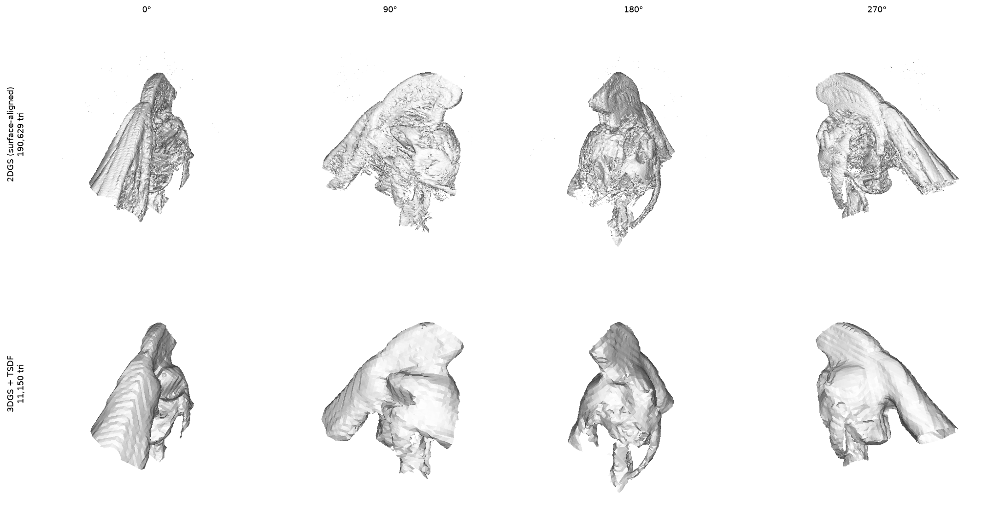<br>
  <em>Same crop, same camera path, both meshes. 2DGS resolves the crest ridges and plume
  strands; the 3DGS TSDF mesh has the gross form but visible terracing. Note the two run
  at different TSDF resolutions (190 k vs 11 k triangles), so this is a qualitative
  comparison, not a controlled one.</em>
</p>

**The helmet-only config.** `configs/pipeline/casque/casque_helmet.yaml` restricts the
training loss to the subject via the `object_masks` stage (projected after SfM, so it never
touches pose estimation):

| | full-scene model | **helmet deliverable** |
|---|---|---|
| `cap_max` | 6 M | **375 k** |
| Gaussians | 5.27 M | **341 k** |
| `.ply` | 1.3 GB | **81 MB** |

**16× smaller**, and the masked capacity sweep says 190 k–6 M are all tied, so nothing was
given up. (PSNR across the two is not comparable — different pixel populations.)

**Where the error that remains actually sits:**

<p align="center">
  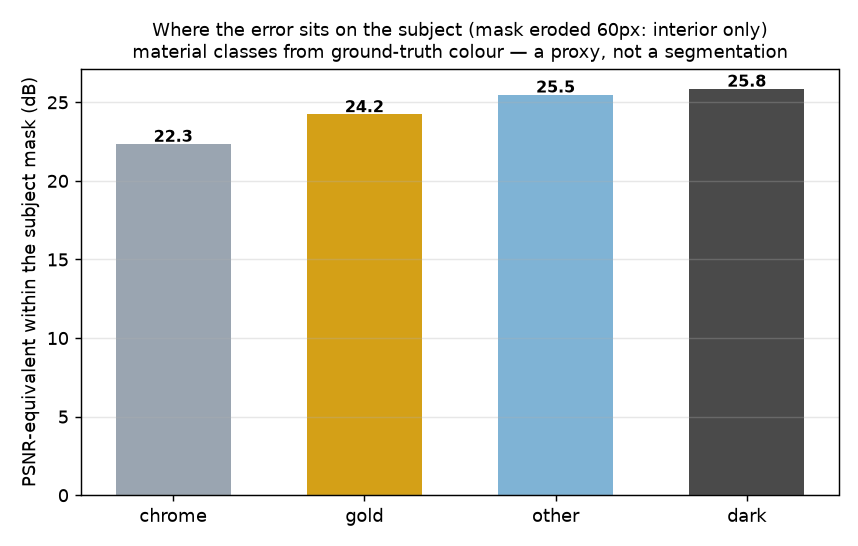</p>

The chrome dome is the worst class (**22.3 dB** vs gold's **24.2**) — the softness on the
reflective surface is measurable, not just an impression. But erode the mask before
believing any of it: unerorded, "dark" looks like a second problem area at 21.1 dB and is
almost entirely *background rim* (25.9 dB once eroded). Chrome survives that check, which
is what makes it credible. Headroom is bounded: if every class matched the best one the
subject would gain **~2.2 dB** — worth weighing before implementing GaussianShader /
3DGS-DR / Spec-Gaussian, which all mean rasteriser changes.

Because the *full-scene* model contains a whole auditorium, that one isolates the helmet
**at export** instead:

```bash
# centre = the orbit's convergence point (where all optical axes meet)
python scripts/crop_object.py exports/casque_2dgs_nodist/mesh.ply helmet.ply \
       --center -0.183 0.166 0.220 --half-extent 0.24     # 497 MB -> 7.8 MB
python scripts/mesh_preview.py helmet.ply --out preview.png --views 4
```

Two traps worth recording, both of which cost a wrong figure before being caught:
the scene's up axis is **not** +Z (`[0.166, −0.860, −0.483]`, confirmed to 7.3° by the
camera ring's own normal), and the box centre is best derived from the orbit geometry
rather than guessed — every camera looks at the helmet, so the least-squares meeting
point of the optical axes *is* the object centre.

### The subject is data-limited, not model-limited

Every comparison in this project until now asked "which model is cheaper" or "which scores
better on the pixels it happened to be trained on". Neither answers the question that matters
when the object *is* the deliverable. Scoring **every** model on the **same pixels** — the
helmet — gives one flat answer:

| model | subject PSNR | | model | subject PSNR |
|---|---|---|---|---|
| unmasked 1.5 M | 22.72 | | masked 190 k | 22.65 |
| unmasked 6 M | 22.66 | | masked + specular head | 22.66 |
| unmasked 12 M | 22.65 | | masked 375 k | 22.44 |

**Every paired comparison is a tie.** Across a **63× capacity range**, masked and unmasked,
with and without a specular head, the helmet sits at ~22.7 dB. It is **data-limited**, and
that single fact retrospectively explains the rest of this case study: why the masked
capacity curve is flat, why the specular head is a null, why 12 M buys nothing. Every
modelling knob is saturated.

Which means the remaining levers are **data-side** — resolution (the source is 3840 px and
we were training at 2560) and coverage (three further clips of the same helmet went unused).
Reproduce the ranking with:

```bash
python scripts/subject_quality.py casque_orbit_07ccd886 RUN_A RUN_B \
       --masks-from casque_orbit_07ccd886 --width 1419 --erode 30
```

`--masks-from` is not optional for a cross-dataset comparison: each dataset generates its
own masks, and scoring two models through two different apertures made the same pair read as
"0.89 dB worse, significant" one way and "0.40 dB better, tie" the other.

### Validate on the subject, not the frame

<p align="center">
  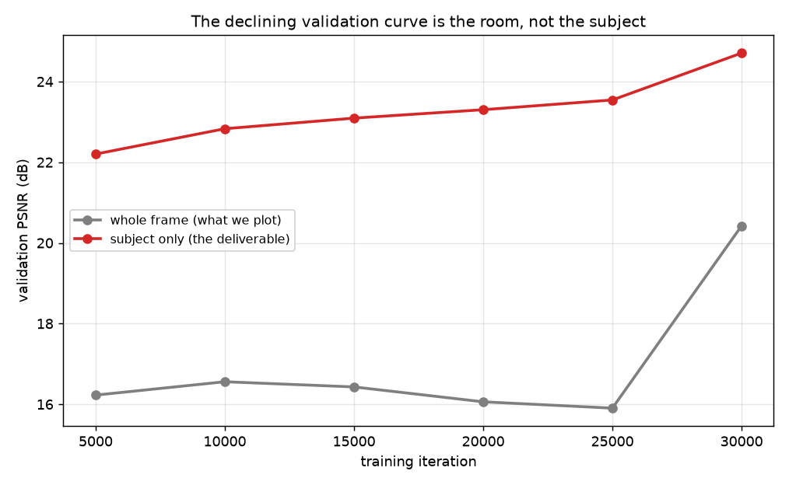<br>
  <em>Same checkpoints, two measurements. Regenerate with
  <code>python scripts/object_vs_scene_val.py casque_orbit_07ccd886 casque_gsplat</code>.</em>
</p>

The Casque training curves look alarming: validation PSNR peaks near iteration 7000,
declines for 20 000 steps, then jumps ~4.4 dB at the end. **Nothing is wrong.** Scoring the
same checkpoints on the helmet alone rises monotonically throughout:

| step | 5 000 | 10 000 | 15 000 | 20 000 | 25 000 | 29 999 |
|---|---|---|---|---|---|---|
| whole frame | 16.23 | 16.56 | 16.43 | 16.06 | 15.90 | **20.42** |
| **helmet only** | 22.20 | 22.83 | 23.09 | 23.30 | 23.54 | **24.71** |

The decline belongs to the room, which stays unsettled until the MCMC noise scale decays at
the end of the schedule; the saved renders show the helmet stable from early on while the
background flips between dark and correct.

This is not cosmetic. `best_val` and `early_stop_patience` both read the whole-frame number
— early stopping is off by default, but a patience of 3 would have killed this healthy run
around iteration 10 000. **The trainer now scores a subject-only pass whenever masks exist
and selects on it**, logging both so the gap stays visible (`psnr` and `psnr_object` in
`metrics.jsonl`).

Two plausible mechanisms were checked and ruled out first, by measurement rather than
argument: the floater opacity-kill firing in the same iteration as validation (it kills
0 Gaussians here), and near-dead Gaussians fogging the render (pruning opacity < 0.005
mid-training moves PSNR by 0.00 dB).

### Novel-view paths are chosen from measured rig geometry

The Casque's first turntable was unusable — the subject was a few pixels wide in a black
frame, wrapped in floater haze. Two causes, both from Pavillon assumptions baked into the
reporting code:

| | Before | Now |
|---|---|---|
| Camera path | always the front arc (a full 360 was avoided because a single-sided capture never saw the back) | true 360 orbit **when the rig is measured to orbit** |
| Framing distance | fit the **whole scene** bounding box → framed the auditorium | the capture's **own median camera distance** → reproduces the photographer's framing |
| Floater crop | `crop_box_normalized` from the point cloud → spans the room (6.1 units on one axis vs ~1.2) | box centred on the measured subject, sized by camera distance |

The discriminator is **inwardness** = `1 − |mean(view direction)|`. Cameras ringing a
subject look inward from all sides and their direction vectors cancel; cameras sweeping
one face of a wall all point the same way. Measured: **0.61 / 0.75** for the two orbit
captures, **0.15 / 0.14** for the two single-sided ones — a wide gap, so the threshold
isn't delicately placed. Note that *azimuth coverage* fails as a discriminator: both types
score above 300°, because on a single-sided sweep the optical axes converge at a point
inside the camera swarm.

This keys off geometry rather than the declared `capture_mode`, which defaults to `orbit`
and was left at that for the single-sided Pavillon — so the config could not be trusted.
The Pavillon path is unchanged (it measures as single-sided and still gets the front arc).

<p align="center">
  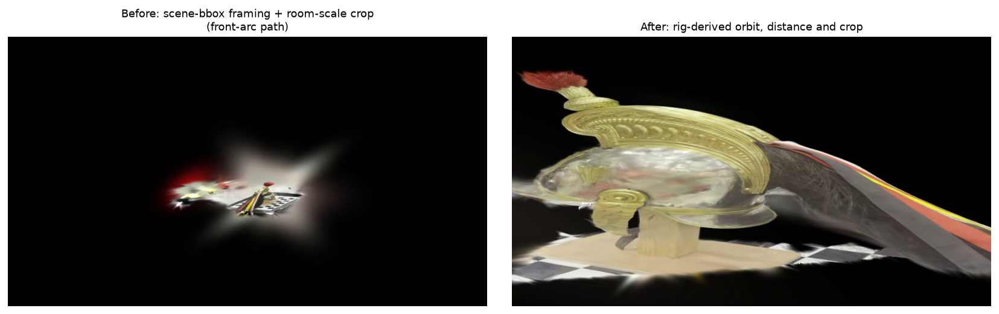<br>
  <em>Same model, same frame index. Left: framed on the scene bbox with the room-scale
  crop. Right: rig-derived path, distance and crop.</em>
</p>

**3. Pose refinement — our explanation was wrong.** We had attributed its 1 dB Pavillon
cost to poses already being sub-pixel (0.92 px). The Casque's mixed pro+iPhone set
registers at 1.57 px, so there should have been error to recover. There was not:
**−0.54 dB, CI [−0.71, −0.36]**, improving only 9 of 53 views. It is now a negative on
*both* captures, so the "poses were already too good" story does not survive; the likelier
account is that our SE(3) refinement trades multi-view consistency for per-view fit.

## Quickstart

```bash
# 0. one-time environment (torch cu128/cu130 + gsplat + COLMAP/GLOMAP)
scripts/bootstrap_environment.sh

# 1. verify the target GPU node actually works (drivers here are inconsistent)
srun --partition=rtxpro --nodelist=GPURACK2 --gres=gpu:1 --time=00:25:00 \
  bash -lc 'export MAX_JOBS=4; source scripts/_activate_env.sh; python scripts/gsplat_selftest.py'

# 2. full reconstruction: extract → filter → GLOMAP → normalize → split
#    → train → evaluate → export → visualize
sbatch scripts/slurm/train.sbatch configs/pipeline/pavillon/pavillon_orbit_hidetail.yaml

# 3. train a sibling model on the SAME reconstruction (skips the expensive SfM)
sbatch scripts/slurm/train.sbatch configs/pipeline/pavillon/pavillon_orbit_reg.yaml \
       --force --from-stage train
```

Per-stage control, all with `--dry-run / --force / --resume / --verbose / --set k=v`:

```bash
python -m video_to_3dgs.cli inspect-env --gpu-check      # driver, sm_120, gsplat smoke test
python -m video_to_3dgs.cli extract-frames --config <cfg>
python -m video_to_3dgs.cli reconstruct    --config <cfg>   # COLMAP / GLOMAP
python -m video_to_3dgs.cli train          --config <cfg>
python -m video_to_3dgs.cli evaluate       --config <cfg>   # held-out only
python -m video_to_3dgs.cli export         --config <cfg>   # .ply + cameras + transforms
python -m video_to_3dgs.cli run-all        --config <cfg> [--from-stage S --only S]
python -m video_to_3dgs.cli status         --config <cfg>
```

Analysis utilities:

```bash
python scripts/floater_spatial.py <dataset_id> <a.ply> <b.ply> out.png   # floater comparison, CPU-only
python scripts/gsplat_selftest.py                                        # per-node CUDA/gsplat check
python scripts/make_demo_assets.py <dataset_id> --train-run <id>         # README demo assets: SfM pose
                                                                         # figure, orbit GIF, report figures
                                                                         # -> docs/assets/<object>/ (CPU-only)
```

---

## How it works

```
video → inspect → extract frames → quality filter → [masks] → COLMAP/GLOMAP
      → validate → normalize → pose-aware split → train (gsplat) → evaluate
      → export (.ply) → report (figures + videos)
```

The **filesystem is the source of truth** — no daemon, no database. Each stage is
the only writer of its own status file and reaches `COMPLETED` only after its
outputs validate, so a crash never leaves a false success. A fingerprint over
(parameters + input checksums) drives skip/rerun and invalidates downstream stages
automatically. Training checkpoints atomically and resumes from the latest valid
checkpoint; SIGTERM flushes a checkpoint and exits 0 for Slurm requeue.

**Techniques implemented** beyond vanilla 3DGS:

| Technique | Knob | Notes |
|---|---|---|
| Global SfM | `run_colmap.mapper_backend: glomap` | 2.2× registration on low-overlap capture |
| Room bounds | `train.bounds` | constrains Gaussians to the captured volume |
| Anti-floater | `train.floater` | scale/opacity suppression + final hard prune |
| Monocular depth prior | `train.depth_prior` | DepthAnything-v2 + scale-invariant Pearson loss |
| Appearance embeddings | `train.appearance_embedding` | per-image latent → affine colour transform |
| 2DGS surface backend | `train.backend: 2dgs` | implemented; underperforms on this capture |

---

## Documentation

- **[docs/reproduce_pavillon.md](docs/reproduce_pavillon.md)** — reproduce the model end-to-end (start here)
- **[docs/reproduce_casque.md](docs/reproduce_casque.md)** — the Casque helmet (object-centric orbit, multi-camera — inverts the Pavillon lessons)
- **[docs/technique_transfer.md](docs/technique_transfer.md)** — every technique, Pavillon → Casque, and whether it transferred
- [configs/pipeline/README.md](configs/pipeline/README.md) — config layout + one-config-per-object / `--set`-for-sweeps convention
- **[docs/report/theory.tex](docs/report/theory.tex)** — cited theory: representation, EWA projection, compositing, density control, depth priors, appearance modelling
- [docs/pipeline_architecture.md](docs/pipeline_architecture.md) · [docs/colmap_guide.md](docs/colmap_guide.md) · [docs/capture_guide.md](docs/capture_guide.md) · [docs/troubleshooting.md](docs/troubleshooting.md)
- [state/decisions.md](state/decisions.md) — every technical decision with its evidence, **including retractions**

## Capture advice (learned the hard way)

The single biggest determinant of quality is **coverage**, and no amount of
regularization recovers a surface that only one camera saw well. When filming:
orbit the object rather than panning, vary elevation, keep generous overlap
between consecutive frames, lock exposure/white-balance if you can, and avoid
extreme close-ups at grazing incidence — those were every one of our worst
reconstructed views.
