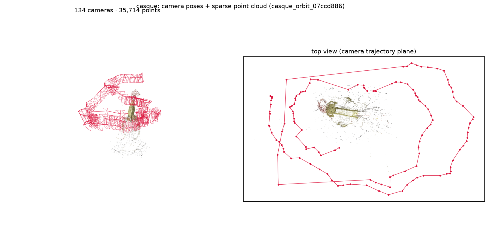

# Reconstructing the Casque Saint-Georges

An object-centric orbit capture of a helmet (Saint-Georges), shot with a
**professional camera *and* an iPhone**. It is deliberately contrasted with the
Pavillon here, because the two captures sit at opposite ends of almost every axis and
therefore call for opposite settings.

<p align="center">
  <br>
  <em>The SfM solution: 134 registered cameras orbiting the helmet at two
  elevations, and the 36 k-point sparse cloud. Regenerate with
  <code>python scripts/make_demo_assets.py casque_orbit_07ccd886</code>.</em>
</p>

## Why this capture differs from the Pavillon

| Axis | Pavillon (scene) | Casque (object) | Consequence |
|---|---|---|---|
| Coverage | single-sided, low parallax | **full orbit**, high parallax | far more capacity: **6 M**, 16x the Pavillon's 375k |
| Subject vs scene | relief carved *into* a wall | **free-standing** helmet | isolate the helmet **in 3D** (crop), not by mask — see below |
| Cameras | one iPhone clip | **pro camera + iPhone** | **appearance embeddings** reconcile the two responses |
| Surface method | 2DGS failed (no multi-view normals) | multi-view surface | **2DGS works** (with `dist_lambda: 0`) — use it for the mesh |
| Interest | the whole panel | the **helmet only** | spatial crop to the helmet; 360° orbit video |

The two things carried over from the Pavillon: **normal-consistency** (a cleaner mesh)
and the **anti-floater** prune. Everything else is inverted.

## Configs

- `configs/pipeline/casque/casque.yaml` — recommended 3DGS reconstruction.
- `configs/pipeline/casque/casque_2dgs.yaml` — surface mesh via 2DGS (the capture 2DGS
  was built for).

- `configs/pipeline/casque/casque_multiclip.yaml` — all clips merged, with per-image
  appearance embeddings and `single_camera: false` (the pro camera and iPhone have
  different intrinsics).

Both single-clip configs use GLOMAP, **masks off** (see step 2) and start from the
single 4K clip; the multi-clip config is the one that needs appearance embeddings.

## Steps

1. **Turn the monocular depth prior OFF** (already set in the config). It helps the
   Pavillon and costs almost nothing there, so we carried it over — but ablated here it
   **loses 0.89 dB** (21.25 → 20.35, CI [+0.28, +1.51] for removing it, 9/13 views) and is
   worse on SSIM and LPIPS too. DepthAnything is trained on ordinary photographs, so on a
   mirror-like surface it predicts the depth of the *reflected scene* rather than of the
   surface: a chrome helmet gets confidently wrong targets exactly where photometric
   supervision is weakest, while the orbit's parallax already pins the geometry. Treat
   monocular depth priors as suspect on any reflective subject.

2. **Verify the footage.** The folder holds pro clips (`102A25xx.MOV`), iPhone clips
   (`IMG_8xxx.MOV`) and stills. Curate `videos:` down to the clean full orbits; short
   establishing clips can hurt. Check each with:
   ```bash
   python -m video_to_3dgs.cli inspect-video --config configs/pipeline/casque/casque.yaml
   ```

3. **Do NOT mask this capture** (a gate test settled it). rembg's salient-object model
   swings from 0.1% to 45% of the frame across the orbit — chrome reflections, a wispy
   horsehair plume and a competing stand defeat it. More importantly, the scene has a
   **checkerboard calibration target** (the best SfM features present) while the chrome
   helmet has almost none, so mask-only COLMAP would throw away the features that give
   good poses. Reconstruct the full scene and isolate the *free-standing* helmet
   spatially afterwards. (`rembg` needs `onnxruntime`; masking is the right tool only
   when the object is genuinely salient — a matte object on a plain background.)

4. **Run it** (env + node pre-flight identical to the Pavillon —
   see [reproduce_pavillon.md](reproduce_pavillon.md) §0–1):
   ```bash
   sbatch --partition=rtxpro --nodelist=GPURACK2 --gres=gpu:1 --cpus-per-task=8 \
          --export=ALL,MAX_JOBS=4,OMP_NUM_THREADS=4 \
          scripts/slurm/train.sbatch configs/pipeline/casque/casque.yaml
   ```

5. **Tune capacity for THIS object.** 375k was the Pavillon optimum *because* it was
   sparse-view; an orbit has real parallax, so the optimum is higher. Run the short
   sweep (reuses the SfM, so only training re-runs):
   ```bash
   for cap in 750000 1500000 3000000 6000000 12000000; do
     sbatch ... scripts/slurm/train.sbatch configs/pipeline/casque/casque.yaml \
            --force --from-stage train \
            --set train.depth_prior.enabled=false \
            --set train.densification.cap_max=$cap \
            --set train.train_run_id=casque_cap${cap}
   done
   ```
   Measured on the held-out split (13 test views):

   Measured with the depth prior **off** (step 0 — it is harmful here, see step 3):

   | `cap_max` | 750 k | 1.5 M | 3 M | **6 M** | 12 M |
   |---|---|---|---|---|---|
   | PSNR | 19.84 | 21.25 | 22.15 | **23.41** | 23.27 |
   | SSIM | 0.8598 | 0.8664 | 0.8705 | **0.8740** | 0.8733 |
   | LPIPS | 0.2843 | 0.2586 | 0.2434 | 0.2260 | **0.2241** |

   Read the *paired* per-view comparison, not the means. Three doublings are all real —
   750 k → 1.5 M **+1.41 dB** [+0.81, +2.01], 1.5 M → 3 M **+0.90 dB** [+0.41, +1.39],
   3 M → 6 M **+1.26 dB** [+0.35, +2.18] — and then it stops: 6 M → 12 M is **−0.14 dB,
   CI [−0.69, +0.41]**, a tie. **Use 6 M**; 12 M is tied at twice the size (3.8 GB vs
   7.7 GB checkpoints). Regenerate the curve and these statistics with:
   ```bash
   python scripts/capacity_curve.py --out docs/assets/capacity_curve.png
   ```

   > **Sweep with the rest of the config already settled.** Our first sweep ran with the
   > depth prior on, whose damage grows with capacity (+0.35 dB at 750 k, +1.39 at 3 M).
   > That flattened the top of the curve, so 1.5 M → 3 M read as a tie and we wrongly
   > concluded the curve plateaued at 1.5 M. A confound that scales with the variable you
   > are sweeping does not just shift the curve — it changes its shape.

   The Pavillon's 375 k optimum does **not** transfer: copying it here costs more than two
   decibels. The transferable rule is the method, not the number.

6. **Mesh.** Run `casque_2dgs.yaml` for a surface-aligned mesh; also export the 3DGS
   TSDF mesh (`export` emits `mesh.ply` automatically) and compare. Unlike the
   Pavillon, 2DGS has the multi-view coverage it needs here — it reaches **20.19 dB, a
   statistical tie with 3DGS** (−0.16 dB, CI [−1.26, +0.94]), which is the success
   condition for a surface method: same photometric quality, plus a real surface.

   **One setting decides this**, and it is already fixed in the config: `dist_lambda: 0`.
   With the 2DGS default of 1.0 the run peaks at 24.6 dB val and then collapses the
   instant the loss engages at iteration 7000, ending 4.40 dB lower.

   <p align="center">
     <br>
     <em>Left: the collapse is caused, not gradual — it starts exactly at the
     regularizer's start iteration. Right: held-out test PSNR. Regenerate with
     <code>python scripts/dist_collapse_figure.py</code>.</em>
   </p>

## The turntable video

The fly-around path, its distance and the floater crop are all derived from the measured
rig geometry, so no per-object tuning is needed — an orbit capture automatically gets a
true 360 at the photographer's own framing distance, cropped to the subject. To
(re)generate it for a specific training run:

```bash
sbatch --partition=rtxpro --nodelist=GPURACK2 --gres=gpu:1 --cpus-per-task=8 \
  --wrap "source scripts/_activate_env.sh && \
  python -m video_to_3dgs.cli visualize --config configs/pipeline/casque/casque.yaml \
    --force --train-run-id casque_gsplat --set report.orbit_radius_scale=1.7"
```

Use `--train-run-id`, not `--set train.train_run_id=...`: the stage reloads the frozen
config, so a `--set` on the run id is discarded and you will silently render whichever run
last wrote that config. Knobs: `report.orbit_radius_scale` (pull back if the subject
clips) and `report.object_crop_scale` (raise if the crop eats scenery you want, lower if
haze survives).

Then refresh the README assets:
```bash
python scripts/make_demo_assets.py casque_orbit_07ccd886 --train-run casque_gsplat \
       --gif-width 520 --gif-fps 10
```

## What to watch for

- **Appearance drift** (logged): if the pro/iPhone response differs a lot, the affine
  latents will show non-zero drift and are doing real work. If a *spatially varying*
  difference appears (vignetting), switch `appearance_model` to `bilateral`.
- **The object box is a tested negative here.** An explicit tight box
  (`train.bounds.box_center` / `box_half_extent`) around the helmet is implemented, and
  it *sounds* right for an object capture. It did not help: no sharper helmet, plus
  boundary smearing. The helmet is **data-limited, not budget-limited**, and with masks
  off the box fights the photometric loss over the background it still has to explain.
  Isolate the helmet by **cropping at export** instead. The box remains useful for
  genuinely mask-separable objects.
- **Capacity is the setting to tune per object**, and the Pavillon's answer does not
  carry over — see the sweep in step 4 and
  [technique_transfer.md](technique_transfer.md).
