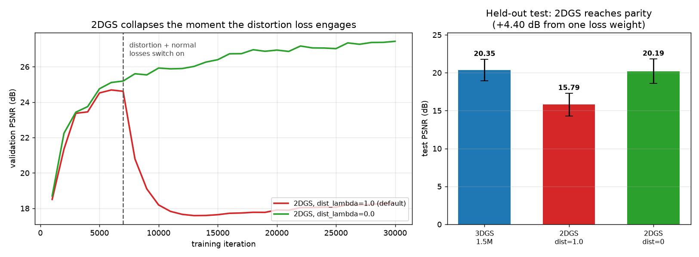

# Technique transfer: Pavillon → Casque

Every technique developed on the Pavillon (single-sided carved wall relief), assessed
for the Casque (orbit of a free-standing reflective helmet), with the outcome. The
point is that a result is not a law: several Pavillon findings **invert** on a capture
with the opposite geometry, and the table records which.

Legend: ✅ applied & helps · ➖ applied, low impact here · 🔬 under test · ❌ tested,
does not help · ⏭️ deliberately skipped.

| Technique | Pavillon result | Casque relevance | Status |
|---|---|---|---|
| **GLOMAP** global SfM | 181/193 vs 82 (incremental) | High — 4 clips, two cameras | ✅ 533/536 @ 1.57 px |
| Scene-scale + LR-decay fixes | PSNR 14 → 24 | Framework-wide | ✅ automatic |
| **Resolution** (no downscale) | +1.8 dB, tail → 0 | Limited — only 1 of 4 clips is 4K | ➖ 2560 px, capped by 1080p clips |
| **Anti-floater** (bounds + prune) | 18.2 % → 0 % haze | Yes | ✅ applied |
| **Depth prior** (DepthAnything-v2) | nearly free (0.26 dB) | Assumed "low impact" — **wrong** | ❌ **hurts: −0.89 dB**, CI [+0.28, +1.51] off−on |
| **Capacity** sweep | 375 k optimal (*less is more*) | **INVERTS** — an orbit is not sparse-view | ✅ **6 M** optimal (**16×** the Pavillon) |
| **MCMC** densification | parity, cleaner control | Yes | ✅ applied |
| **Normal-consistency** | mesh coherence 0.81 → 0.92 | Yes (helmet mesh) | ✅ applied |
| **Appearance embeddings** | unlocks multi-clip (+3 dB) | Multi-clip only | ✅ multi-clip · ❌ single-clip tie (−0.09 dB, CI [−0.60, +0.41]) |
| Bilateral-grid appearance | tie (no spatial variation) | Possible (pro/iPhone vignetting) | ⏭️ low priority |
| **Pose optimization** | −1 dB (poses already 0.9 px) | Hypothesis falsified — hurts again | ❌ −0.54 dB, CI [−0.71, −0.36] |
| Capture resolution 2560→native 4K | Pavillon +1.8 dB | sparse orbit: too few views | ❌ −0.72 dB, CI [+0.20,+1.23] 2560-over-4K |
| Specular head (reflection SH) | n/a | chrome is worst class (−1.9 dB) | ❌ tie overall, chrome slightly worse |
| **2DGS** surface backend | FAILED, 13 dB (single-sided) | **Works** — a real orbit supplies the normals | ✅ parity w/ 3DGS, `dist_lambda=0` |
| Object box (attract to subject) | n/a | tested | ❌ no sharper helmet + smearing (data-limited) |
| Generative diffusion prior | worse at every strength | Same regime, and helmet is data-limited | ⏭️ skip |
| Object-region metrics | n/a | Helmet fills the frame (mask ~100 %) | ➖ limited |
| TSDF mesh + object crop | works (soft) | Yes | ✅ applied |

## The three findings that motivated the transfer tests

Because the Casque geometry is the Pavillon's opposite, three Pavillon results are not
safe to assume and are being measured rather than copied:

1. **Capacity inverts — CONFIRMED.** The Pavillon optimum was *375 k*: surplus Gaussians
   overfit its low-parallax views. An orbit supplies real multi-view constraint, so the
   overfitting pressure is weaker and the optimum should be *higher*. It is:

   | `cap_max` | 750 k | 1.5 M | 3 M | **6 M** | 12 M |
   |---|---|---|---|---|---|
   | with depth prior *(confounded)* | 19.49 | 20.35 | 20.76 | — | — |
   | **no depth prior (recommended)** | 19.84 | 21.25 | 22.15 | **23.41** | 23.27 |

   **A correction worth reading, because the confound changed the curve's shape and not
   just its level.** Measured *with* the depth prior — which every earlier number here
   used — 1.5 M → 3 M came out at **+0.41 dB, CI [−0.45, +1.26]**, a tie, and we
   concluded the curve "rises then plateaus" with 1.5 M as the operating point. With the
   prior removed, every doubling up to 6 M is significant:

   - 750 k → 1.5 M: **+1.41 dB, CI [+0.81, +2.01]**, 12/13 views
   - 1.5 M → 3 M: **+0.90 dB, CI [+0.41, +1.39]**, 11/13 views
   - 3 M → 6 M: **+1.26 dB, CI [+0.35, +2.18]**, 12/13 views
   - 6 M → 12 M: **−0.14 dB, CI [−0.69, +0.41]**, 7/13 — **a tie**

   Three significant doublings, then the curve flattens: **6 M is the operating point**,
   with 12 M statistically tied at twice the size. The per-step gains do not decay on the
   way up (+1.41, +0.90, +1.26), so the flattening at 6 M is a real ceiling rather than
   slow saturation. Budget utilisation confirms the model really spends what it is given:
   each run ends at ~88 % of its cap (671 k, 1.32 M, 2.64 M, 5.27 M, 10.64 M), the
   shortfall being the final opacity prune.

   The prior's damage *grows with capacity* (+0.35 at 750 k, +0.89 at 1.5 M, +1.39 at 3 M),
   which is what flattened the top of the curve and manufactured the plateau: more
   primitives means more of them pulled toward the reflection-depths the prior supplies
   (see the depth-prior section below).

   So the two captures differ by **16×** in optimal budget — 375 k versus 6 M. **We then
   tested why, and the answer is not the object.**

   The proposed reading was that capacity sizes *the amount of observed scene content*
   rather than the subject: the Pavillon is one wall seen from one side, while this is an
   entire auditorium observed across 310° of azimuth, with the helmet a small part of what
   the model must explain. That predicted something falsifiable — restrict the loss to the
   helmet and the optimum should collapse. Same pipeline, same poses, same split, loss
   masked to the subject:

   | masked `cap_max` | 190 k | 375 k | 750 k | 1.5 M | 6 M |
   |---|---|---|---|---|---|
   | test PSNR | 22.81 | 23.10 | 23.03 | 22.96 | 23.06 |

   **Every step is a tie** — 190 k → 375 k → 750 k → 1.5 M → 6 M, no significant difference
   anywhere across a **32× range** (widest paired delta +0.29 dB, CI [−0.13, +0.72]). The
   *same* pipeline on the full frame gained significantly at every doubling up to 6 M.

   So the unifying statement is not "capacity inverts between captures" but:
   **the Gaussian budget is set by how much observed scene the loss must reproduce, not by
   the subject.** One wall → 375 k. An auditorium → 6 M. The helmet alone → ≤ 190 k, which
   is *below* the Pavillon's optimum even though this is the higher-parallax capture.

   (Absolute PSNR in the masked table is not comparable to the unmasked numbers — different
   pixel population. Only the shape is, and the shape is flat.)

   The practical consequence is large: if you only want the object, masking the loss buys a
   **30×** smaller model at no measurable cost — 190 k versus 5.3 M Gaussians, ~50 MB
   versus 3.8 GB.

   **A second, independent test of the same claim.** If capacity really tracks *how much
   observed scene the loss must reproduce*, then enlarging the masked region should make
   capacity matter again. Masking helmet **plus its checkerboard base** (a box of half-extent
   0.35 instead of the helmet mesh):

   | masked region | 375 k → 1.5 M |
   |---|---|
   | helmet only | tie (and every other step, 190 k–6 M) |
   | **helmet + board** | **+1.97 dB, CI [+1.29, +2.65], 13/13 views** |

   Capacity goes from irrelevant to strongly significant purely by widening the mask. The
   checkerboard is a high-frequency textured plane, so it is exactly the kind of content that
   consumes primitives. The prediction was made before the measurement and could have failed;
   it did not.

   (The two rows are separate pixel populations, so their absolute PSNRs are not comparable
   — only the presence or absence of a capacity effect within each row is.)

   The methodological rule survives its own correction: **sweep capacity per capture, read
   the paired CI rather than the mean — and settle the rest of the configuration first**,
   or the sweep measures the confound instead of the capacity.

2. **2DGS works here — CONFIRMED, after one loss weight was fixed.** It collapsed on the
   Pavillon because a surface-aligned disk must recover a normal that a single-sided
   capture never observes. A helmet orbit observes every surface from many directions,
   which is exactly the evidence 2DGS needs.

   The first run *looked* like the same failure — 15.79 dB vs 20.35 for 3DGS. The
   trajectory said otherwise: it was at **24.6 dB and still climbing** until the
   distortion and normal regularizers engaged at iteration 7000, then decayed
   monotonically for 23 k more iterations. Setting `dist_lambda: 0` recovers
   **+4.40 dB, CI [+2.32, +6.48]** (12/13 views) and lands at 20.19 — **a statistical
   tie with 3DGS** (−0.16 dB, CI [−1.26, +0.94]).

   

   Parity is the *success* condition for a surface method: the same photometric quality
   while producing a surface-aligned mesh. The distortion loss concentrates ray weight
   onto one surface, which suits a bounded object — but masks are off here, so the model
   must also explain a full room at varied depths, and that term fights it.

   **The methodological point:** the final metric alone supported "2DGS does not work on
   this capture." The trajectory supported "2DGS works and one weight was wrong." Those
   are opposite engineering decisions, and only the trajectory distinguishes them.

3. **Pose refinement — hypothesis FALSIFIED.** It cost 1 dB on the Pavillon, which we
   attributed to GLOMAP's poses already being sub-pixel (0.92 px). The mixed pro+iPhone
   Casque set registers at 1.57 px, so there should have been genuine calibration error
   to recover. There was not: **−0.54 dB, CI [−0.71, −0.36]**, improving only 9 of 53
   views. Pose refinement is now a negative on *both* captures, and the "poses were
   already too good" explanation does not survive — a better hypothesis is that our
   SE(3) refinement trades multi-view consistency for per-view photometric fit.

## Higher capture resolution makes a sparse-view subject *worse*

The helmet is data-limited, so the natural move is more data — and the first lever tried,
capture resolution, backfired. Re-running the helmet pipeline at native 3840 px instead
of 2560, on a matched name-keyed split (14 shared held-out views, scored through one common
mask and resampled to a common width):

| | 2560 px | native 4K |
|---|---|---|
| subject PSNR (interior) | **23.99** | 23.61 |
| render sharpness (var-Laplacian) | **6.0** | 2.5 |

Paired, 2560 beats 4K by **+0.72 dB (CI [+0.20, +1.23], 13/14 views)**, and the 4K
renders are measurably *blurrier*, not sharper. This is the sparse-view regime, not a bug: at
4K each Gaussian must explain 2.25× more pixels from the **same 108 viewpoints**, so the
per-pixel fit is more underdetermined and the model smooths. Extra source resolution only
helps if there are enough views to constrain it — which is exactly what the Pavillon had
(+1.8 dB there) and this capture does not.

It is the direct counterpart to the capacity finding: the Pavillon wanted *fewer* Gaussians
and *more* resolution; a sparse orbit of a featureless subject wants the opposite of the
second, for the same underlying reason — too few views to pin down the extra degrees of
freedom.

## Specular head: implemented, and it does not help here

The chrome dome is measurably the worst material class on the helmet (22.3 dB against gold's
24.2), so a reflection-direction specular head was implemented: a second low-order SH bank
per Gaussian evaluated at `r = v − 2(v·n)n` instead of the view direction. That is Ref-NeRF's
reformulation, as carried into splatting by GaussianShader and Ref-Gaussian, in the smallest
form that needs no CUDA changes.

**Result: a tie overall, and slightly worse on the chrome it targets.**

| | SH only | + specular head |
|---|---|---|
| test PSNR | 22.79 | 23.17 (+0.38 dB, CI [−0.24, +1.00] — tie) |
| SSIM | 0.7583 | 0.7496 |
| **chrome class** | **22.34** | **22.12** |

Two candidate explanations, one weak and one strong:

- *Ill-defined normals.* The head reflects about each Gaussian's axis of least variance, and
  for a near-isotropic Gaussian that axis is arbitrary. Measured: **21.9 %** of Gaussians
  have their smallest axis within 20 % of their middle axis. Real, but 78 % are well-defined,
  so this cannot be the whole story.
- **We masked away what the chrome reflects.** The helmet config restricts the loss to the
  subject, so the model never learns the auditorium — and a mirror-like surface is
  reflecting *precisely that* removed environment. A reflection-direction head then has
  nothing coherent to point at. This is being tested on the unmasked model, which does
  contain the room.

If that second explanation holds, it is a genuinely awkward interaction rather than a bug:
**the masking that makes the helmet 30× cheaper also deletes the information a specular
model needs.** The two techniques we most wanted are in tension, and no amount of tuning
either one resolves it.

### A wiring bug that nearly became a false conclusion

The head first measured **−3.66 dB** and looked like a clear failure. It was not: `evaluate`
rebuilds parameters with `create_splats`, which does not allocate the specular bank, so
loading the checkpoint silently dropped it and scored a model rendering its diffuse half
alone. The giveaway was that *validation* — computed inside the trainer, where the head is
applied — showed a **tie** while test showed −3.66 dB. Two held-out splits do not disagree
by 3.5 dB unless they are being measured differently.

This is the second time an inference path silently diverged from training in this project
(the first cost 3.02 dB on the appearance model). Both were invisible in the aggregate and
both were caught by a metric that disagreed with another metric.

## Appearance embeddings are a *merge* tool, not a general one

Enabling per-image appearance latents on the **single** 4K clip was a tie: **−0.09 dB,
95 % CI [−0.60, +0.41]**, 6/13 views. The interval is tight enough to read as a real null
rather than an underpowered test. The mechanism explains it — the latents exist to
reconcile *different* exposure/colour responses, and one continuous iPhone clip does not
drift enough to matter. They earned their +3 dB on the Pavillon only when merging clips.

So the rule is not "object captures want appearance embeddings"; it is **"turn them on
when you merge sources, and not otherwise."**

## The depth prior actively hurts a specular object

This row was originally marked "low impact here" by *reasoning*: it moved the Pavillon only
0.26 dB, and an orbit supplies real parallax, so a monocular depth prior should matter even
less. That is the same style of argument that produced the capacity and pose-refinement
predictions — one inverted, one was falsified. It was not evidence and should not have sat
in a table of measurements. Measured, everything else identical:

| | PSNR | SSIM | LPIPS |
|---|---|---|---|
| depth prior ON (what every earlier Casque number used) | 20.35 | 0.8636 | 0.2710 |
| **depth prior OFF** | **21.25** | **0.8664** | **0.2586** |

Paired per-view: **+0.89 dB from removing it, 95 % CI [+0.28, +1.51]**, 9/13 views, and
better on all three metrics. Not "nearly free" — it was costing about a decibel.

**The likely mechanism is specularity, and it generalises.** DepthAnything is trained on
ordinary photographs. On a mirror-like surface it returns the depth of the *reflected
scene* rather than of the surface, because that is what such a surface looks like. A chrome
helmet therefore receives confidently wrong depth targets exactly where photometric
supervision is already weakest. Combined with an orbit's real parallax leaving little for a
prior to add, the prior is all cost and no benefit. The rule this suggests — to be tested
rather than assumed, given the above — is that **monocular depth priors suit sparse-view,
low-parallax, matte captures, and should be treated as suspect on reflective subjects.**

**Two consequences worth stating plainly.** Every other Casque number in this document was
measured with the harmful prior enabled, including the capacity sweep. Those comparisons
remain internally valid (all arms carried it), but the absolute figures are ~0.9 dB
pessimistic, and the depth-off capacity curve is being re-measured to confirm the optimum
does not move. Second, the ablation could never have run before: the codepath with the
prior disabled crashed at iteration 7000 (a flag conflated "needs a depth render" with
"apply the depth loss"), so the configuration had shipped untested behind a default.

## Findings that transferred as-is

- **GLOMAP, the trainer fixes, anti-floater, MCMC, normal-consistency and appearance
  embeddings** all apply unchanged and help. The checkerboard even makes GLOMAP's job
  *easier* here (shared features across all clips) than on the Pavillon.
- **Masks are the exception to "object capture ⇒ mask it".** rembg was unreliable on the
  chrome/plume/stand subject, and masking would have discarded the checkerboard — the
  best SfM features. The Casque is reconstructed unmasked and the helmet isolated in 3D.

## The meta-lesson

The same discipline transferred even where the techniques did not: **judge by looking,
report negatives, and measure rather than assume.** The object box, generative priors,
and (on the Pavillon) 2DGS and pose refinement are all documented negatives — each cost
a probe, not a project, precisely because they were tested rather than trusted. The
per-capture answer is the point; the framework is the same.
